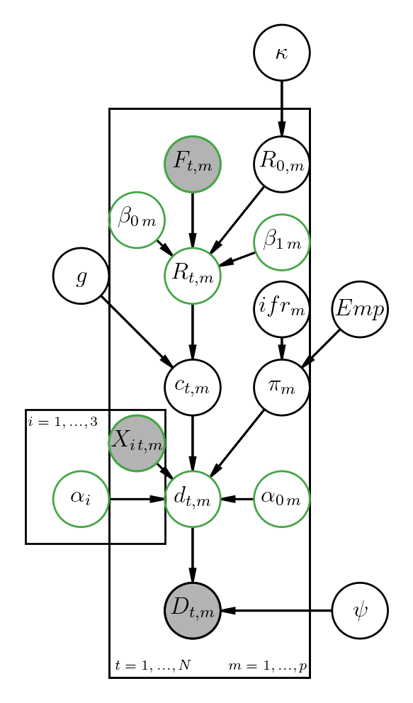

```{r include=F}
knitr::opts_chunk$set(echo = FALSE,
                      tidy.opts=list(width.cutoff=60),
                      tidy=TRUE)
percent <- function(x, digits = 2, format = "f", ...) {
  paste0(formatC(100 * x, format = format, digits = digits, ...), "%")
}
library(tidyverse)
load("grant.R")


centinela<- data_country %>% filter(time=="2020-03-28")  %>% 
  select(predicted_cases_c,predicted_min_c,predicted_max_c)
```


# Anexo 2

## Presentación de la propuesta.

**Datos del responsable Técnico : ** Dra. Ruth Selene Fuentes García. Profesor Titular “A”. Facultad de ciencias, UNAM.

**Título: ** Estimación y proyección del impacto de las medidas de mitigación por COVID-19 en las 32 entidades federativas de México utilizando redes bayesianas.

## Datos generales.

```{r prop,include=TRUE}
knitr::kable(cars,caption = "Propuesta a desarrollar")
```

## Descripción del proyecto.

### Introducción y antecedentes

Los coronavirus [@arabi2020covid] son una familia de virus que suelen causar enfermedades en animales, aunque algunos pueden afectar también a humanos. En las personas pueden producir infecciones respiratorias que pueden ir desde un resfriado común hasta enfermedades más graves. En el 80% de los casos, la infección por este nuevo coronavirus, denominado oficialmente SARS-Cov-2, produce síntomas respiratorios de carácter leve. Con el nombre de COVID-19 se denomina la enfermedad respiratoria producida por este virus. Hasta el día de hoy (`r format(max(data_covid$date), "%b %e")`) se han confirmado en nuestro país `r formatC(confirmados, format="f", big.mark=",", digits=0)` casos y `r formatC(muertes, format="f", big.mark=",", digits=0)`muertes. Mucho se ha hablado de la importancia de las medidas de mitigación para tratar de frenar la epidemia y así evitar la saturación de los hositales, especialmente aquellos de tercer nivel. La razón detrás de implementar estas medidas es el número básico de reproducción $R_0$, el cual mide en promedio cuantas personas son infectadas por una persona con la infección en una población susceptible. Una consecuencia de lo anterior es que en medida en que más personas se infecten, el número de reproducción disminuirá ya que en algún punto en el futuro se lograría la inmunidad de rebaño; a causa de esta temporalidad se introduce el número de efectivo de reproducción $R_t$ [@nishiura2009effective], teniendo la misma definición que $R_0$ pero ahora a tiempo $t$.

En nuestro país, tanto los gobiernos estatales como el gobierno federal han implementado diferentes medidas de mitigación con el objetivo de disminuir $R_t$, ya que al hacerlo resultaría en un número menor de infectados por SARS-Cov-2 y en consecuencia un número menor de hospitalizaciones y muertes. Si $R_t<1$ entonces se podría afirmar que la transmisión está bajo control y por lo tanto se podrían retirar una o varias medidas de mitigación.

#### Vigilancia epidemiológica en México

La vigilancia epidemiológica en nuestro país se basa en un sistema centinela a través del sistema de Unidades de Salud Monitoras de Enfermedades Respiratorias (USMER), adoptado desde el año 2006. El objetivo de las unidades es brindar información epidemiológica de varios virus (e.g. influenza) de forma oportuna y completa, sin olvidar que éste no tiene como objetivo recopilar los casos completos en el país sino privilegiar la calidad de la información recopilada en estas unidades [@deguia]. El 28 de febrero se confirmó el primer individuo con CoVID-19 en nuestro país, desde entonces se ha actualizado la definición operacional (siendo el 23 de marzo la última actualización) para casos sospechosos y casos confirmados:

* Caso sospechoso - Persona de cualquier edad que en los últimos siete días haya presentado al menos dos síntomas de tos, fiebre o cefalea, es decir, dolor de cabeza intenso y persistente y que esté acompañado de los siguientes signos: dificultad para respirar, hinchazón en articulaciones con dificultad de movimiento, dolor muscular, ardor de garganta, rinorrea, conjuntivitis y dolor de tórax.

* Caso confirmado - Persona que cumpla lo anterior y que cuente con confirmación del InDRE.

Asimismo, se modificó el porcentaje de muestreo para vigilar los casos de COVID-19. Solo se realizará la prueba al 10% de los casos sospechosos sin síntomas o síntomas leves. A su vez, se realizará la prueba al 100% de los casos sospechosos con sintomatología grave o que cumplan con la definición infección respiratoria aguda grave (IRAG).

#### Características de los pacientes graves con COVID-19

Se estima que aproximadamente un 5% de los casos confirmados por cOVID-19 requerirán de cuidados intensivos [@murthy2020care]. Lo anterior ha mostrado que ciertos países en el mundo experimentaran un rápido incremento en la utilización de recursos sanitarios, sobre todo aquellos países con una proporción importante de adultos mayores de 65 años [@remuzzi2020covid]. Si bien es cierto que en nuestro país solamente el 7.25% de la población pertenece a este grupo de edad (OCDE), la evidencia en otros países ha revelado que la obesidad y sus comorbilidades asociadas son un factor de riesgo importante para aquellas personas menores de 60 años [@lighter2020obesity]. Lighter et al. encontraron que [-@lighter2020obesity] aquellos pacientes menores a 60 años con índice de masa corporal (IMC) de entre 30 y 34 que ingresaron a urgencias por COVID-19 tuvieron 1.8 más posibilidades de ingresar a terapia intensiva en comparación con aquellos pacientes sin obesidad (IMC<30); estas posibilidades aumentaron a 3.6 en aquellos pacientes con un IMC mayor o igual a 35.

De acuerdo a la más reciente Encuesta Nacional de Nutrición (ENSANUT 2018) realizada conjuntamente entre el Instituto Nacional de Salud Pública (INSP) y el Instituto Nacional de Estadística y Geografía (INEGI), aproximadamente 15.2 millones de mexicanos tienen diagnóstico previo de hipertensión mientras que el 75.2% de la población mayor a 2 años tiene obesidad y sobrepeso [@romero2019encuesta]. Asimismo la Secretaria de Salud ha reportado en sus informes técnicos diarios que los 3 principales grupos en riesgo de presentar complicaciones por COVID-19 son: personas mayores a 65 años, personas con Diabetes Mellitus (diagnosticada y no diagnosticada) y personas con hipertensión arterial.

Lo anterior se ha visto reflejado en las muertes de pacientes confirmados con COVID-19 en México [@gobmx]; hasta el 20 de abril del presente año se habían presentado 686 defunciones, siendo hipertensión, diabetes y obesidad las comorbilidades más asociadas con las defunciones (43.1%, 38.3% y 31.4% respectivamente). Debido a la epidemia de enfermedades no transmisibles que existe en nuestro país desde hace tiempo, es posible que México experimente un número alto de defunciones debido a los factores antes mencionados ya que aumentan el riesgo de complicar esta enfermedad.

#### Modelo Bayesiano semi-mecanístico

Muchos de los modelos epidemiológicos se basan en la incidencia de **casos confirmados** para poder hacer estimaciones y/o proyecciones de diferentes desenlaces en salud, ya sea mortalidad, hospitalizaciones, intubaciones, etc. Una de las grandes limitaciones es el tiempo que pasa entre el momento de la infección y el momento que la prueba resulta positiva. Esto se debe a que entre estos dos momentos hay un periodo de incubación (mediana 6 días [@lauer2020incubation]) y un periodo entre que se toma la prueba y se entrega el resultado de ésta (mediana 9 días [@gob]). Una consecuencia de esto es que los casos confirmados que se presentan día a día son en realidad los casos que se infectaron hace 2 semanas o más.
Adicionalmente, el sistema de vigilancia centinela no realiza pruebas a aquellos que no cumplen la definición operacional, implicando que este sistema no logra capturar a todas las personas asintomáticas. Esto pudiera generar diferentes brotes ya que existe evidencia científica relacionada a la transmisión del virus por parte de los que no presentan ningún tipo de síntoma [@Bai]. Debido a estas limitaciones, diferentes investigadores en enfermedades infecciosas han utilizado las muertes observadas como la variable principal para hacer inferencia en diferentes modelos epidemiológicos ([@flaxman2020report]). 

Por lo tanto, proponemos estimar el impacto que han tenido las medidas de mitigación en el número diario de infecciones por SARS-Cov-2, en el número de pacientes que requieran terapia intensiva y finalmente en el número de muertes, utilizando las **muertes diarias** como la variable observable para entrenar nuestro modelo. Utilizaremos un modelo jerárquico Bayesiano semi-mecanístico^[Es semi-mecanístico ya que utiliza la estructura de los modelos compartimentales pero sin la necesidad de especificar el sistema de ecuaciones diferenciales] [@staff2019correction] debido a la dependencia que existe entre los parámetros. Una ventaja de este tipo de modelos semi-mecanísticos es que los parámetros a estimar están influenciados por la variable observable y por lo tanto ésta representa un peso importante al momento de realizar la inferencia.

Nuestro modelo es una adaptación de un modelo epidemiológico europeo que midió el mismo desenlace en 14 países diferentes [-@flaxman2020report]; nuestra propuesta se basa en modificar algunos parámetros y adaptarlo para que la inferencia y proyecciones resulten en dos productos finales:

1. Producto a nivel estatal.
2. Producto a nivel Zona Metropolitana del Valle de México (ZMVM).

## Justificación

Gracias a que contamos con información respecto a lo que ha ocurrido en otros países, le evidencia ha mostrado [@flaxman2020report;@ferguson2020report] que la reducción en el número efectivo de reproducción se traduce en menos infecciones y por lo tanto en menos muertes. Asimismo la evidencia mostró que la implementación de diferentes medidas de mitigación en el tiempo impacta de manera significativa a $R_t$. Nuestro modelo utilizará información sobre estas medidas masivas implementadas en los estados de la república mexicana para estimar que impacto tienen estas medidas en el número efectivo de reproducción (y en consecuencia el impacto que tienen en los otros parámetros del modelo).

El modelo producirá los siguientes desenlaces en salud con sus respectivos niveles de incertidumbre, a nivel estatal y nivel municipios y alcaldías de la ZMVM:

1. Número efectivo de reproducción $R_t$.
2. Número de infectados ($c_t$) al tiempo $t$. Esta estimación será la estimación total de personas infectadas por SARS-Cov-2, es decir, sintomáticas y asintomáticas.
4. Número de esperado muertes ($d_t$) al tiempo $t$.

Con estas estimaciones será posible proyectar cualquiera de los desenlaces antes mencionados en el futuro. Nuestra idea es que el usuario, ya sea cualquier persona o tomador de decisión, pueda accesar a nuestro modelo de manera remota y generar diferentes estadísticas, gráficas o mapas interactivos, utilizando las bases precargadas en el modelo o utilizando los mismos datos proporcionados por el usuario.


## Objetivo general

**Estimar el impacto que tienen las diferentes intervenciones de mitigación en el número de reproducción, número de infecciones por SARS-Cov-2 y número de muertes a través del tiempo. Una vez estimado el modelo se proyectarán diferentes desenlaces para contribuir a la toma de decisiones. Nuestro objetivos específicos son:

1. Actualizar los parámetros en nuestro modelo mediante una revisión rápida de la literatura.
2. Entrenar nuestro modelo utilizando las muertes diarias reportadas a nivel estatal y a nivel zMVM. Esto implicará validar nuestro modelo utilizando diferentes técnicas estadísticas para controlar un posible "sobreajuste" del modelo.
3. Crear una plataforma en línea en la cual el usuario pueda ver los resultados en tiempo real para ambos niveles de análisis. Asimismo crear una aplicación en la misma plataforma donde el usuario pueda reproducir el modelo utilizando los datos pre-cargados o los propios.

## Acercamiento teórico y conceptual

Como ya se mencionó en la introducción, el modelo utilizará las muertes observadas de acuerdo a los datos oficiales del gobierno de México, los cuales se encuentran en el portal "Datos abiertos" y son actualizados de manera diaria. La Figura \@ref(fig:modelo) muestra el nivel jerárquico (de abajo hacia arriba) que nos permite relacionar el impacto de diferentes medidas de mitigación (i.e. cierre de escuelas,etc.) y las muertes observadas. Dada la relación que existe entre los diferentes parámetros a estimar, el modelo realizará la inferencia utilizando un enfoque Bayesiano. La relación entre los parámetros se explica a grandes rasgos a continuación utilizando la misma notación que el modelo original [-@flaxman2020report]. Es importante mencionar que el modelo original contiene parámetros de la evidencia publicada en el resto del mundo y por esta razón nuestro trabajo incluye actualizar éstos con el fin de tener estimaciones con la evidencia más reciente.

```{r modelo, echo=FALSE, fig.cap="Representación del modelo utilizando grafos causales acíclicos. Se puede observar la relación entre los diferentes parámetros en el modelo. Los nodos grises representan las variables observadas. Los nodos con contorno verde representan nuestras modificaciones con respecto al modelo original.",fig.align="center"}

```

### Muertes observadas

El número de muertes observadas $D_{t,m}$ para los días $t\in1,...,n$ en la región $m\in1,...,p$  serán obtenidas de fuentes estatales y federales [@gob]. Éstas son modeladas utilizando su valor esperado, es decir, $d_{t,m}=\mathbf{E}[D_{t,m}]$. El modelo asume que $D_{t,m}$ tiene una distribución binomial negativa con los siguientes parámetros:

$$D_{t,m}\sim binomial neg\left(d_{t,m},d_{t,m}+\frac{d_{t,m}^2}{\psi}\right)$$
$$\psi \sim N^+(0,5)$$

donde $\psi$ tiene una distribución normal truncada. El número esperado de muertes $d$ en un determinado día es una función del número de infecciones $c$ que ocurrieron en días previos. Para poder unir las muertes con los casos infectados, se utiliza la tasa de mortalidad por infección ($ifr$, infection mortality rate en inglés) que toma en cuenta tanto a los detectados como los no detectados^[La tasa de letalidad solo contempla a los detectados mientras la tasa de mortalidad por infección contempla a todas las personas infectadas.] y el tiempo que pasa entre la infección y la muerte, la cual denotamos con $\pi_{m}$. Si bien no hay un dato para las entidades federativas hasta el momento para $ifr_m$, se puede utilizar lo ya estimado a nivel mundial, el cual es aproximadamente 0.9% [@verity2020estimates]. Esta tasa podrá ser actualizada una vez que nueva evidencia sea publicada con respecto a las distintas entidades federativas.

Con el fin de introducir incertidumbre a esta tasa, asumimos que

$$ifr_{m}^*\sim ifr_{m}(N(1,0.1))$$
 Donde $N$ tiene una distribución normal con media 1 y desviación estándar 0.1.


Con base en estudios previos [@baud2020real], el modelo asume que $\pi_m$ es una suma de dos tiempos independientes: el tiempo de incubación (tiempo entre infección y síntomas) y el tiempo entre síntomas y muerte. Estos tiempos son aleatorios y por lo tanto se les asigna una distribución de probabilidad (Gamma^[Parametrizada con la media de la distribución y su coeficiente de variación.]). Por lo tanto $\pi_{m}$ está dado por:

$$\pi_{m}\sim ifr_{m}^*((Gamma(5.1,0.86)+Gamma(18.8,0.45))$$

Ahora que ya sabemos que $\pi_{m}$ representa la distribución entre el tiempo de infección y muerte ajustada por la tasa de mortalidad por infección, se puede relacionar el número esperado de muertes en un determinado día $d_{t,m}$ con $\pi_{m}$ de la siguiente manera:

$$d_{t,m}=\sum_{\tau=0}^{t-1} c_{\tau,m}\pi_{t-\tau,m}exp(\alpha_{0\,m}+\alpha_1X_{1\,t,m}+\alpha_2X_{2\,t,m}+\alpha_3X_{1\,t,m}X_{2\,t,m})$$

donde $c_{\tau,m}$ es el número de nuevas infecciones en el día $\tau$ y donde $\pi_{m}$ es discretizado. Decidimos también agregar algunas variables asociadas con las muertes esperadas, tales como edad poblacional $X_{1\,t,m}$, la proporción de pacientes con Diabetes $X_{2\,t,m}$ en la región $m$ y una interacción entre ambas. Estos datos serán obtenidos de fuentes institucionales, específicamente del INEGI y de la ENSANUT 2018. La ecuación anterior nos dice que el número de muertes esperadas al día $t$ puede ser expresado como la ponderación entre el número de infecciones en días pasados y la probabilidad de morir, ajustado por edad y la proporción de diabetes en determinada región. Asimismo decidimos que cada región $m$ tuviera su propio intercepto $\alpha_{0\,m}$ y que las regiones comparten las pendientes $\alpha_i,i=1,2,3$. Utilizamos distribuciones no-informativas e independientes entre sí^[aunque exploraremos el caso en el que los parámetros vengan de una distribución Normal multivariada]:

$$
\begin{aligned}
 \alpha_{m}\sim Normal(0,10) \\
 \alpha_i\sim Normal(0,10)
\end{aligned}
$$

### Infecciones en el modelo


Hasta ahora he resumido la relación que puede existir entre el número de muertes y el número de infecciones al día $t$. Para modelar el número de infecciones en el tiempo es necesario especificar el tiempo que pasa entre el inicio de síntomas de una persona y el inicio de síntomas de otra persona infectada por la primera (en inglés se conoce como **serial interval**). De acuerdo a la literatura [@zhou2020clinical] el promedio de este tiempo ronda entre los 4 días y 8 días, por lo que el modelo asume que éste tiene una distribución gamma^[Misma parametrización con media y cv.] con los siguientes parámetros:

$$ g \sim Gamma(6.5,0.62)$$
El número de infecciones $c_{t,m}$ al día $t$ está dada por el siguiente proceso de renovación [@branch]:

$$c_{t,m}=R_{t,m}\sum_{\tau=0}^{t-1} c_{\tau,m} g_{t-\tau,m}$$

donde $g$ también es discretizada. Lo anterior implica que las infecciones al día de hoy dependen de las infecciones en días pasados, ponderadas por la distribución $g$. Esta ponderación es ajustada por el numero efectivo de reproducción $R_{t,m}$. Éste número cambia con respecto al tiempo debido a que la implementación de diferentes medidas de mitigación en teoría hará que éste disminuya y por lo tanto haya menos contagios.

La idea es empezar con un número de reproducción basal $R_{0,m}$ y que este se irá modificando en el tiempo debido a la implementación de diferentes intervenciones en las regiones.

Para facilitar la estimación de $R_{t,m}$, se utiliza un predictor lineal que modifique $R_{t,m}$ a partir de un valor inicial $R_{0,m}$, tomando en cuenta que $R_t$ solo toma valores postivicos. Por lo tanto el número efectivo de reproducción $R_{t,m}$es una función de la implementación de cada intervención al día $t$:

$$R_{t,m}=R_{0,m}exp(\beta_{0\,m}+\beta_{1\,m} F_{t,m})$$

donde $F_{t,m}$ es la variable que mide la reducción del flujo peatonal al tiempo $t$ en la región $m$. Estos datos de flujo serán adquiridos en diferentes medios como (http://sintrafico.com/) y (https://www.safegraph.com/). Las distribuciones a priori serían no-informativas, donde cada región m tendría su propio intercepto y su propoa pendiente:

$$
\begin{aligned}
 \beta_{0\,m}\sim Normal(0,10) \\
 \beta_{1,m}\sim Normal(0,10)
\end{aligned}
$$


La distribución de $R_{0,m}$ fue asumida con base en la evidencia previa [@zhang]:

$$R_{0,m}\sim Normal(2.4,|\kappa|),\kappa\sim Normal(0,0.5)$$

Finalmente el modelo asume que las nuevas infecciones ocurren 20 días antes de que el país haya acumulado 10 muertes observadas. A partir de esta fecha, simulamos 6 días seguidos de infecciones $c_{1,m},...,c_{6,m}\sim Exponencial(\iota)$, donde $\iota\sim Exponencial(0.3)$, Estas infecciones se infieren con nuestra distribución posterior.

### Resultados preliminares

Previo a este sometimiento, nos dimos a la tarea de estimar el modelo utilizando los datos agregados a nivel país, i.e., análisis a nivel México, utilizando los datos de muertes observadas  que reporta la Secretaría de Salud a las 7 pm. Asimismo utilizamos el modelo publicado previamente [@flaxman2020report] y no hemos incluido ni las variables que afectan la mortalidad ni la variable que mide el flujo peatonal. Programamos el modelo con `R` y `Stan` y nuestro interés es seguir usando código libre, abierto y reproducible.

El modelo estima que para `r format(max(data_covid$date), "%b %e")`, el número acumulado de infectados por SARS-COV2 en nuestro país es de `r formatC(tail(data_country[,"predicted_cases_c"],1), format="f", big.mark=",", digits=0)` (95% CrI: `r paste(formatC(tail(data_country[,"predicted_min_c"],1), format="f", big.mark=",", digits=0),"-",formatC(tail(data_country[,"predicted_max_c"],1), format="f", big.mark=",", digits=0))`) (ver Figura \@ref(fig:infect)). Lo anterior representa al `r percent(tail(data_country[,"predicted_cases_c"],1)/pop)` (95% CrI: `r paste(percent(tail(data_country[,"predicted_min_c"],1)/pop),"-",percent(tail(data_country[,"predicted_max_c"],1)/pop))`) de la población total en nuestro país, utilizando los datos de CONAPO para 2020 (127 millones de mexicanos aproximadamente).

¿Cómo podemos saber si nuestra modelo estima de manera correcta nuestros resultados? Una forma es comparar los resultados de nuestro modelo con las estimaciones hechas con el sistema centinela por parte del gobierno federal. El 9 de abril se presentó una estimación de los casos totales al finalizar la semana epidemiológica 13. que concluyó el 28 de marzo de acuerdo a los documentos técnicos de la Dirección de Epidemiología. Nuestro modeló estimo que para el 28 de marzo habían  `r formatC(as.numeric(centinela[1]), format="f", big.mark=",", digits=0)` casos acumulados (95% CrI: `r paste(formatC(as.numeric(centinela[2]), format="f", big.mark=",", digits=0),"-",formatC(as.numeric(centinela[3]), format="f", big.mark=",", digits=0))`), mientra que para esa fecha el modelo centinela estimó 26,519 casos. Si bien la estimación de la Secretaría se encuentra contenido en nuestro intervalo de credibilidad, la diferencia entre uno y otro se debe a lo comentado del sistema centinela en la introducción: el sistema no toma muestras de los asintomáticos. Nuestra estimación se basa en la relación que hay entre infectados y la tasa con la que mueren éstos $ifr$.

```{r infect,message=FALSE, warning=FALSE, tidy=TRUE,fig.width=7, fig.height=5.5,fig.cap="Nuevas infecciones por SARS-Cov-2. La región azul representa la incertidumbre de nuesta estimación (línea negra). El histograma representa los casos confirmados reportados diariamente por la S. Salud"}
p4+labs(title = "Nuevos casos de infección por SARS-Cov-2",
  caption = "Datos: Informe diario S. Salud",
        subtitle = paste("Datos hasta", format(max(data_covid$date), "%b %e, %Y"),"México"))+ 
   theme(plot.title = element_text(size = rel(1), face = "bold"),
         plot.subtitle = element_text(size = rel(1)),
         axis.text.y = element_text(size = rel(1)),
         axis.title.x = element_text(size = rel(1)),
         axis.title.y = element_text(size = rel(1)),
         axis.text.x = element_text(size = rel(1)),
         legend.text = element_text(size = rel(1)),
         panel.grid.major = element_line(colour = "grey90", size = .1),
         panel.background = element_blank(),
         axis.line = element_line(colour = "grey50", size = .9))
```


Al inicio de la epidemia en México, el número efectivo de reproducción $R_t$  (ver Figura \@ref(fig:repro)) era de `r formatC(head(data_country[,"rt"],1), format="f", big.mark=",", digits=1)` (95% CrI: `r paste(formatC(head(data_country[,"rt_min"],1), format="f", big.mark=",", digits=1),"-",formatC(head(data_country[,"rt_max"],1), format="f", big.mark=",", digits=1))`). Después de que el gobierno implementó "Susana Distancia" el 23 de Marzo, éste descendió a `r formatC(tail(data_country[,"rt"],1), format="f", big.mark=",", digits=1)` (95% CrI: `r paste(formatC(tail(data_country[,"rt_min"],1), format="f", big.mark=",", digits=1),"-",formatC(tail(data_country[,"rt_max"],1), format="f", big.mark=",", digits=1))`).


```{r repro,message=FALSE, warning=FALSE, tidy=TRUE,fig.width=7, fig.height=5.5,fig.cap="Impacto de las medidas de mitigación en el número efectivo de reproducción."}
p3+labs(title = " Numero efectivo de reproducción",
  caption = "Datos: Informe diario S. Salud",
        subtitle = paste("Datos hasta", format(max(data_covid$date), "%b %e, %Y"),"México"))+ 
   theme(plot.title = element_text(size = rel(1), face = "bold"),
         plot.subtitle = element_text(size = rel(1)),
         axis.text.y = element_text(size = rel(1)),
         axis.title.x = element_text(size = rel(1)),
         axis.title.y = element_text(size = rel(1)),
         axis.text.x = element_text(size = rel(1)),
         legend.text = element_text(size = rel(1)),
         panel.grid.major = element_line(colour = "grey90", size = .1),
         panel.background = element_blank(),
         axis.line = element_line(colour = "grey50", size = .9))
```

Una de las ventajas de este modelo es que nos permite hacer predicciones del número acumulado de muertes, utilizando $R_t$ estimado en `r format(max(data_covid$date), "%b %e")` y su contrafactual^[Lo que pudo haber ocurrido] ($R_t$ al inicio de la epidemia en nuestro país); estas predicciones se muestran en la Figura \@ref(fig:muerte). Con estos resultados es posible estimar cuantas muertes se han evitado hasta el día de hoy, lo anterior se obtiene al calcular la diferencia entre ambas predicciones (región azul menos región roja de la Figura \@ref(fig:muerte) en `r format(max(data_covid$date), "%b %e")`). Gracias a las medidas de mitigación se han podido evitar 
 `r formatC(muertes_evitadas[1], format="f", big.mark=",", digits=0)` (95% CrI: `r paste(formatC(muertes_evitadas[2], format="f", big.mark=",", digits=0),"-",formatC(muertes_evitadas[3], format="f", big.mark=",", digits=0))`) muertes.

```{r muerte,message=FALSE, warning=FALSE, tidy=TRUE,fig.width=7, fig.height=5.5,fig.cap= "Número acumulado de muertes por COVID-19, observados y predichos. El eje de las y está transformado con el logaritmo base 10. El histograma representa las muertes observadas de acuerdo al informe técnico diario de la S. Salud"}
p2+labs(title = " Numero acumulado de muertes confirmadas con SARS-Cov-2",
  caption = "Datos: Informe diario S. Salud",
        subtitle = paste("Datos hasta", format(max(data_covid$date), "%b %e, %Y"),"México"))+ 
   theme(plot.title = element_text(size = rel(1), face = "bold"),
         plot.subtitle = element_text(size = rel(1)),
         axis.text.y = element_text(size = rel(1)),
         axis.title.x = element_text(size = rel(1)),
         axis.title.y = element_text(size = rel(1)),
         axis.text.x = element_text(size = rel(1)),
         legend.text = element_text(size = rel(1)),
         panel.grid.major = element_line(colour = "grey90", size = .1),
         panel.background = element_blank(),
         axis.line = element_line(colour = "grey50", size = .9))
```

## Grupo de trabajo

El equipo de trabajo está conformado por investigadores con conocimientos sólidos en Estadística Bayesiana, Bioestadística, Modelación de Enfermedades Infecciosas y/o Políticas Públicas en Salud para la toma de decisiones. El equipo y su relación con el proyecto se describe a continuación:

Dra. Ruth Selene Fuentes García. Profesor Titular  “A”, Facultad de Ciencias, UNAM. - Estudió el doctorado en Estadística en la Universidad de Bath, Reino Unido. Cuenta con 14 años de experiencia en la docencia, de los cuales 8 han sido como profesora de tiempo completo. La Dra. Ruth cuenta con varias publicaciones en revistas indexadas tanto nacionales como internacionales . También ha sido sinodal en más de 50 exámenes profesionales y de posgrado. Sus principales áreas de interés son: análisis de datos multivariados, clasificación no supervisada, modelos de mezclas y Estadística Bayesiana. La Dra. Ruth se encargará de supervisar el proyecto, participando conjuntamente en la modificación del grafo causal acíclico, en la elaboración del código para estimar el modelo y finalmente de la coordinación entre el equipo de trabajo y diferentes actores que sean necesarios para la ejecución del proyecto.

Dr. Osvaldo Espin-García. Bioestadístico Senior, UHN. Toronto, Canadá. - Doctor en Bioestadística por la Universidad de Toronto. El Dr. Osvaldo provee consultoría y apoyo estadístico a investigadores clínicos y de ciencia básica en diversos estudios principalmente relacionados con cáncer, donde ha colaborado como Bioestadístico en estudios observacionales y ensayos clínicos aleatorizados. Asimismo el Dr. Osvaldo ha sido acreedor de diferentes becas competitivas en Canadá que le ayudaron a consolidarse como investigador en Bioestadística con especialización en cáncer. Sus líneas de investigación son el diseño, desarrollo e implementación de nuevas metodologías en Bioestadística, Estadística genética y Epidemiologia genética enfocado a enfermedades complejas como diabetes, enfermedad de Crohn y cáncer, a través de colaboraciones inter- y/o multi- disciplinarias. Él se encargará de la modificación del grafo causal así como de la validación del modelo.

Dr. Fernando Alarid Escudero. Profesor investigador, PPD, CIDE. - Doctor en Políticas de Salud con especialización en Ciencias de la Decisión por la Universidad de Minnesota. El Dr. Alarid-Escudero es profesor investigador en el Programa de Políticas de Drogas (PPD) en el Centro de Investigación y Docencia Económicas, AC (CIDE) Región Centro en Aguascalientes, México. Su investigación se centra en el desarrollo de modelos estadísticos y matemáticos para identificar estrategias óptimas de prevención, control y tratamiento de diferentes enfermedades, y en el desarrollo de métodos novedosos para cuantificar el valor de futuras investigaciones. Actualmente se encuentra desarrollando en colaboración con la universidad de Stanford un modelo compartimental epidemiológico para COVID-19 (https://www.sc-cosmo.org/). El Dr. Fernando se encargará de asesorar la construcción del modelo con el objetivo de tener un modelo que refleje el contexto mexicano.

Dr(c). Juan Pablo Díaz Martínez. Investigador asociado, UHN. Toronto, Canadá. - Candidato a Doctor en Políticas de salud con especialización en modelos predictivos por la Universidad de Toronto. Juan Pablo cuenta con una posición de investigador asociado en el Hospital General de Toronto, donde brinda asesoramiento estadístico a diferentes epecialidades médicas en el hospital. Recientemente Juan Pablo participó en un grupo de investigación para predecir diferentes desenlaces en salud por COVID-19 para el ministerio de Salud de la Provincia de Ontario (https://www.covid-19-mc.ca/). Sus tesis doctoral se basa en el uso de modelos predictivos en cáncer de próstata para determinar la progresión de la enfermedad y su efecto en la calidad de vida del paciente. Juan Pablo se encargará de programar el algoritmo para entrenar los datos.

La infraestructura será aportada por la Facultad de Ciencias de la UNAM. Ésta cuenta con un equipo amplio dedicado a la administración de recursos obtenidos por convocatorias nacionales e internacionales. Debido a la situación actual en México y el mundo, todo el trabajo se realizará de manera remota por lo que no será necesario utilizar las instalaciones de la Facultad.

## Productos esperados

La Figura \@ref(fig:crono) muestra la información referente a los productos esperados:

```{r crono, echo=FALSE, fig.cap="Cronograma de actividades desglosado por objetivo específico.",fig.align="center"}

```

## Beneficios, resultados y usuarios finales

El beneficio principal será tener un modelo que mida el efecto de las medidas de mitigación en diferentes desenlaces relacionados con la enfermedad. Todo el código será replicable, reproducible y abierto bajo la licencia MIT (https://opensource.org/licenses/MIT).

Desde investigadores hasta tomadores de decisiones, la plataforma brindará estadísticas para los niveles previamente descritos con el fin de que los usuarios tengan información en tiempo real. La metodología del modelo será descrita en su totalidad, con el fin de poder recibir retroalimentación de otros grupos de trabajo. La plataforma se irá actualizando conforme al avance de los objetivos específicos 1 y 2. El usuario podrá, por ejemplo, proyectar las infecciones y muertes al incrementar o disminuir la variable flujo peatonal; lo anterior servirá como una herramienta más para la toma de decisiones basada en evidencia.

Otro beneficio tangible es que nuestro modelo podrá informar y complementar otros modelos epidemiológicos que se dearrollan en la actualidad para nuestro país. De igual manera la información que genere la plataforma será representada como información geoespacial, misma que será utilizada para crear mapas interactivos para conocer el estado de la epidemia en distintas partes de nuestro país.

Finalmente, el abordaje Bayesiano nos permitirá utilizar lo ya estimado en futuros modelos epidemiológicos para la misma enfermedad.

## Financiamiento solicitado

La Tabla \@ref(tab:finan) muestra el financiamiento solicitado y su justificación. La mayoría del presupuesto se destinará a software, ya que éste rubro incluye todo el proceso de construcción de la plataforma:

```{r finan,include=TRUE}
knitr::kable(cars,caption = "Financimiento solicitado y justificación")
```


## Bibliografía
